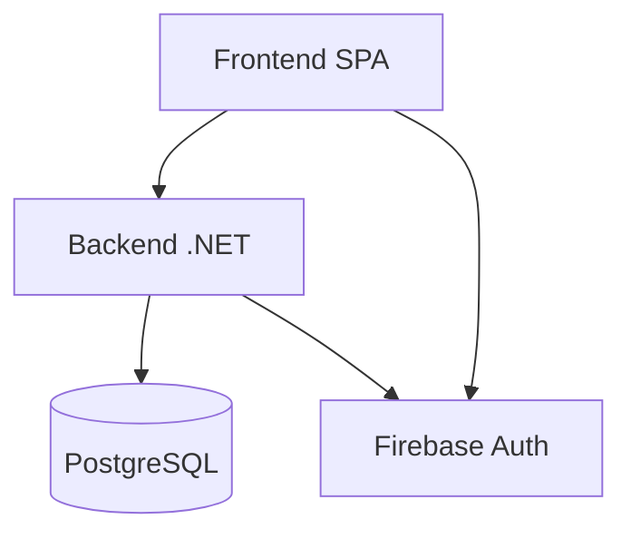

# Arquitetura do L2SLedger

Este documento descreve a arquitetura do **L2SLedger**, consolidando as decisões formais registradas nos ADRs.

---

## Visão Geral

O L2SLedger segue uma arquitetura **modular, auditável e orientada a domínio**, adequada para sistemas financeiros críticos.

---

## Diagrama Conceitual

---

## Camadas

### Frontend

* React + TypeScript
* Não contém regra financeira
* Consome contratos públicos imutáveis
* Testes focados em comportamento

---

### Backend

* Clean Architecture
* Domínio financeiro isolado
* Casos de uso explícitos
* Fail-fast em todas as camadas

---

### Domínio

* Entidades financeiras
* Value Objects
* Invariantes e regras
* Eventos de domínio

---

### Infraestrutura

* PostgreSQL
* Firebase Authentication
* Docker
* OCI

---

## Auditoria

* Todos os eventos financeiros são auditados
* Registros imutáveis
* Correlação com usuários e timestamps

---

## Ambientes

| Ambiente | Finalidade          |
| -------- | ------------------- |
| DEV      | Desenvolvimento     |
| DEMO     | Demonstração segura |
| PROD     | Produção            |

---

## Segurança

* Firebase como IdP único
* Cookies HttpOnly
* RBAC/ABAC no backend
* Isolamento total de ambientes

---

## Evolução

* Contratos imutáveis e versionados
* Migrations controladas
* Alterações exigem ADR

---

## Referências

* `adr-index.md`
* `docs/`

---

*Este documento reflete o estado arquitetural oficial do L2SLedger.*
