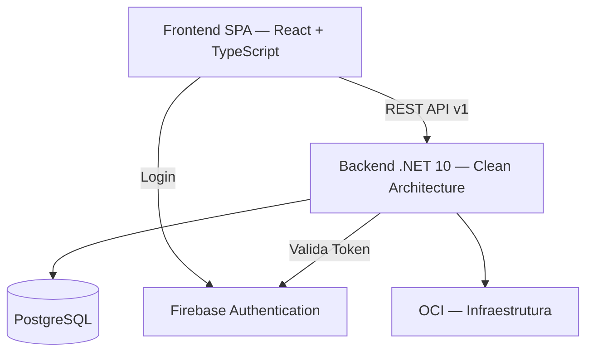

# Arquitetura do L2SLedger

Arquitetura oficial do **L2SLedger**, consolidando as decisões formais dos 47 ADRs do projeto.

---

## Visão Geral

Sistema financeiro **modular, auditável e orientado a domínio**, construído com Clean Architecture e DDD.



---

## Camadas do Backend (ADR-020)

Dependências apontam sempre para o centro:

```
API → Application → Domain ← Infrastructure
```

### Domain (`L2SLedger.Domain`)

- Entidades financeiras: `Transaction`, `Category`, `FinancialPeriod`, `Adjustment`, `AuditEvent`, `Export`, `User`
- Value Objects com invariantes
- Eventos de domínio
- **Zero dependências externas** (ADR-027)

### Application (`L2SLedger.Application`)

- Use Cases explícitos
- DTOs, Validators e Mappers
- Interfaces para inversão de dependência

### Infrastructure (`L2SLedger.Infrastructure`)

- Persistência com EF Core + PostgreSQL (ADR-034)
- Firebase Authentication (ADR-001)
- Health Checks, métricas OpenTelemetry (ADR-006)
- Resiliência: Timeout, Retry e Circuit Breaker (ADR-007)

### API (`L2SLedger.API`)

- Controllers finos (10 controllers)
- Middleware de Correlation ID
- Filtros de erro semântico (ADR-021)
- Configuração de Health Checks e Prometheus

---

## Frontend

- **React 18 + TypeScript + Vite** — SPA
- **Nenhuma regra financeira** — apenas apresentação (ADR-027)
- Consome contratos públicos imutáveis (ADR-022)
- Autenticação via Firebase, sessão via cookies (ADR-004)
- Testes focados em comportamento (ADR-040)

---

## Segurança (ADR-001 a ADR-005, ADR-008, ADR-018)

| Aspecto | Implementação |
| ------- | ------------- |
| IdP | Firebase Authentication (único) |
| Sessão | Cookies HttpOnly + Secure + SameSite=Lax |
| Autorização | RBAC/ABAC no backend (ADR-016) |
| Logout | Revogação de sessão (ADR-003) |
| Rede | Segurança OCI com firewall (ADR-008) |
| Dados sensíveis | Criptografia em repouso e trânsito (ADR-018) |
| Auditoria de acesso | Tentativas negadas registradas (ADR-019) |

> Tokens **nunca** são armazenados no frontend.

---

## Auditoria Financeira (ADR-014, ADR-026)

- Todo evento financeiro gera registro imutável de auditoria
- Correlação com usuário, timestamp e Correlation ID
- Integrada à Clean Architecture via eventos de domínio
- Períodos financeiros com fechamento imutável (ADR-015)
- Exportação de dados em CSV/PDF/API (ADR-017)

---

## Persistência (ADR-034, ADR-035, ADR-036)

- **PostgreSQL** como fonte única de dados
- Migrations versionadas via EF Core
- Política de retenção e arquivamento de dados financeiros
- Backups e Disaster Recovery (ADR-012)
- Seeds de dados por ambiente (ADR-029)

---

## Observabilidade e Resiliência (ADR-006, ADR-007)

- **Logs estruturados** com Serilog + Correlation ID
- **Métricas** via OpenTelemetry + Prometheus (`/metrics`)
- **Health Checks**: `/health`, `/health/ready`, `/health/live`
- **Resiliência**: Timeout, Retry e Circuit Breaker em dependências externas

---

## Contratos da API (ADR-021, ADR-022, ADR-022-a)

- Contratos públicos são **imutáveis**
- Breaking changes exigem versionamento (`/api/v1` → `/api/v2`) e novo ADR
- Erros semânticos com fail-fast:

```json
{
  "error": {
    "code": "AUTH_INVALID_TOKEN",
    "message": "Token expired",
    "timestamp": "2026-01-10T10:30:00Z",
    "traceId": "abc123"
  }
}
```

---

## Ambientes (ADR-028, ADR-030)

| Ambiente | Finalidade           | Isolamento |
| -------- | -------------------- | ---------- |
| DEV      | Desenvolvimento local | Banco, config e secrets próprios |
| DEMO     | Demonstração segura   | Deploy automático |
| PROD     | Produção              | Deploy com aprovação |

Ambientes são **totalmente isolados** — bancos, configurações e secrets nunca se misturam.

---

## CI/CD e Infraestrutura (ADR-031, ADR-032, ADR-033, ADR-043)

- **GitHub Actions** como pipeline de CI/CD
- **Docker** como padrão de containerização (imagens imutáveis)
- Build multi-plataforma: AMD64 + ARM64
- **OCI** como infraestrutura base (VMs ARM64)
- Deploy automático em DEMO, com aprovação humana em PROD
- CI bloqueia merge se testes falharem

---

## Compliance (ADR-013)

- LGPD e proteção de dados financeiros
- Dados pessoais com tratamento controlado
- Política de retenção definida por ADR

---

## Comercialização (ADR-042, ADR-042-a)

- Modelo SaaS com planos de assinatura
- Contratos comerciais consumidos pelo frontend
- Regras de negócio comerciais no backend

---

## Testes (ADR-037, ADR-038, ADR-039, ADR-040)

| Tipo | Escopo | ADR |
| ---- | ------ | --- |
| Unitários | Domain, Application, Infrastructure, API | ADR-037 |
| Integração | Infrastructure, API | ADR-037 |
| Contrato | Garantia de integração entre camadas | ADR-039 |
| Regressão financeira | Cálculos e regras financeiras | ADR-038 |
| Frontend | Comportamento e componentes | ADR-040 |

Pipeline CI é gate obrigatório para merge.

---

## Decisão Arquitetural: Sem BFF (ADR-023)

O projeto **não adota** Backend for Frontend. O backend expõe API REST diretamente consumida pelo frontend SPA.

---

## Referências

- [Índice de ADRs](docs/adr/adr-index.md) — 47 decisões registradas
- [Documentação](docs/README.md)
- [Backend](backend/README.md)
- [Frontend](frontend/README.md)
- [Deploy](docs/deployment/README.md)
- [Governança IA](ai-driven/README.md)

---

*Atualizado em 2026-02-22. Reflete o estado arquitetural oficial do L2SLedger.*
