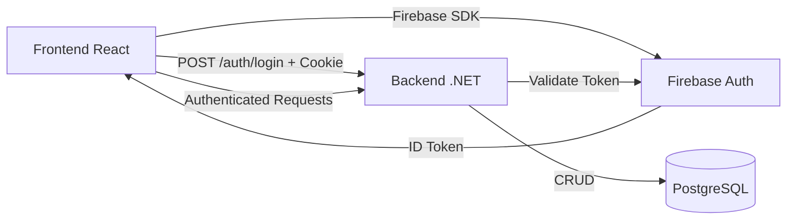

# Documentação Frontend-API para Integração com IA — L2SLedger

> **Data:** 2026-01-23  
> **Versão:** 1.0  
> **Propósito:** Guia completo para integração Frontend React/TypeScript com a API L2SLedger

Esta documentação foi criada para facilitar a integração entre o **Frontend React/TypeScript** e a **API L2SLedger** utilizando ferramentas de IA (Copilot, Cursor, etc.).

---

## Índice

1. [Visão Geral](#1-visão-geral)
2. [Autenticação](#2-autenticação)
3. [Transações Financeiras](#3-transações-financeiras)
4. [Categorias](#4-categorias)
5. [Períodos Financeiros](#5-períodos-financeiros)
6. [Saldos e Relatórios](#6-saldos-e-relatórios)
7. [Exportação](#7-exportação)
8. [Auditoria (Admin)](#8-auditoria-admin)
9. [Usuários (Admin)](#9-usuários-admin)
10. [Modelo de Erros](#10-modelo-de-erros)
11. [Health Checks](#11-health-checks)
12. [Padrões de Implementação](#12-padrões-de-implementação)
13. [Tipos TypeScript](#13-tipos-typescript)

---

## 1. Visão Geral

### 1.1 Arquitetura de Integração



### 1.2 Princípios Fundamentais

| Princípio | Descrição |
|-----------|-----------|
| **Backend é a Verdade** | Toda lógica financeira reside no backend |
| **Frontend Stateless** | Não armazena tokens; usa cookies HttpOnly |
| **Fail-Fast** | Erros são semânticos e imediatos |
| **Contratos Imutáveis** | API contracts não mudam sem versionamento |

### 1.3 Base URL

```typescript
// Desenvolvimento
const API_BASE = 'http://localhost:5000';

// Produção (usar variável de ambiente)
const API_BASE = import.meta.env.VITE_API_URL || '';
```

### 1.4 Headers Padrão

```typescript
const headers = {
  'Content-Type': 'application/json'
};

// IMPORTANTE: Sempre incluir credentials para cookies
fetch(url, { credentials: 'include', headers });
```

---

## 2. Autenticação

### 2.1 Fluxo de Login

```typescript
// 1. Autenticar no Firebase (Frontend)
import { signInWithEmailAndPassword, getIdToken } from 'firebase/auth';

const login = async (email: string, password: string) => {
  const userCredential = await signInWithEmailAndPassword(auth, email, password);
  const idToken = await getIdToken(userCredential.user);
  
  // 2. Enviar para backend (cria cookie HttpOnly)
  const response = await fetch('/api/v1/auth/login', {
    method: 'POST',
    headers: { 'Content-Type': 'application/json' },
    credentials: 'include', // IMPORTANTE: inclui cookies
    body: JSON.stringify({ firebaseIdToken: idToken })
  });
  
  return response.json();
};
```

### 2.2 Endpoints de Autenticação

| Método | Endpoint | Descrição | Auth |
|--------|----------|-----------|------|
| POST | `/api/v1/auth/login` | Login com Firebase Token | Não |
| GET | `/api/v1/auth/me` | Usuário autenticado | Sim |
| POST | `/api/v1/auth/logout` | Encerrar sessão | Sim |
| POST | `/api/v1/auth/firebase/login` | Login direto (DEV only) | Não |

### 2.3 Contratos

**POST /api/v1/auth/login**
```typescript
// Request
interface LoginRequest {
  firebaseIdToken: string;
}

// Response (200 OK)
interface LoginResponse {
  user: UserDto;
  message: string;
}

interface UserDto {
  id: string;           // UUID
  email: string;
  displayName: string;
  emailVerified: boolean;
  roles: string[];      // ['Admin', 'Financeiro', 'Leitura']
  createdAt: string;    // ISO 8601
}
```

**GET /api/v1/auth/me**
```typescript
// Response (200 OK)
interface CurrentUserResponse {
  id: string;
  email: string;
  displayName: string;
  emailVerified: boolean;
  roles: string[];
  createdAt: string;
}
```

**POST /api/v1/auth/logout**
```typescript
// Response (200 OK)
{ message: "Logout realizado com sucesso" }
// Cookie é invalidado automaticamente
```

### 2.4 Erros de Autenticação

| Código | HTTP | Descrição |
|--------|------|-----------|
| `AUTH_INVALID_TOKEN` | 401 | Token Firebase inválido ou expirado |
| `AUTH_EMAIL_NOT_VERIFIED` | 400 | Email não verificado no Firebase |
| `AUTH_SESSION_EXPIRED` | 401 | Sessão expirada (cookie) |

---

## 3. Transações Financeiras

### 3.1 Endpoints

| Método | Endpoint | Descrição | Roles |
|--------|----------|-----------|-------|
| GET | `/api/v1/transactions` | Listar (paginado) | Autenticado |
| GET | `/api/v1/transactions/{id}` | Obter por ID | Autenticado |
| POST | `/api/v1/transactions` | Criar | Autenticado |
| PUT | `/api/v1/transactions/{id}` | Atualizar | Autenticado |
| DELETE | `/api/v1/transactions/{id}` | Excluir (lógico) | Autenticado |

### 3.2 Contratos

**GET /api/v1/transactions**
```typescript
// Query params
interface GetTransactionsParams {
  page?: number;        // default: 1
  pageSize?: number;    // default: 10, max: 100
  categoryId?: string;  // UUID
  type?: 1 | 2;         // 1=Receita, 2=Despesa
  startDate?: string;   // ISO date (YYYY-MM-DD)
  endDate?: string;     // ISO date (YYYY-MM-DD)
}

// Response (200 OK)
interface GetTransactionsResponse {
  items: TransactionDto[];
  totalCount: number;
  page: number;
  pageSize: number;
  totalPages: number;
  totalIncome: number;  // Soma receitas no período
  totalExpense: number; // Soma despesas no período
  balance: number;      // Receitas - Despesas
}

interface TransactionDto {
  id: string;
  description: string;
  amount: number;
  type: 1 | 2;          // 1=Receita, 2=Despesa
  transactionDate: string;
  categoryId: string;
  categoryName: string;
  userId: string;
  notes?: string;
  isRecurring: boolean;
  recurringDay?: number; // 1-31
  createdAt: string;
  updatedAt: string;
}
```

**POST /api/v1/transactions**
```typescript
// Request
interface CreateTransactionRequest {
  description: string;    // required, max 200 chars
  amount: number;         // required, > 0
  type: 1 | 2;           // required, 1=Receita, 2=Despesa
  transactionDate: string; // required, ISO date
  categoryId: string;     // required, UUID
  notes?: string;         // optional, max 1000 chars
  isRecurring?: boolean;  // default: false
  recurringDay?: number;  // 1-31, required se isRecurring=true
}

// Response (201 Created)
TransactionDto
```

**PUT /api/v1/transactions/{id}**
```typescript
// Request (campos opcionais, apenas os enviados são atualizados)
interface UpdateTransactionRequest {
  description?: string;
  amount?: number;
  type?: 1 | 2;
  transactionDate?: string;
  categoryId?: string;
  notes?: string;
  isRecurring?: boolean;
  recurringDay?: number;
}

// Response (200 OK)
TransactionDto
```

**DELETE /api/v1/transactions/{id}**
```typescript
// Response (204 No Content)
// Exclusão lógica (soft delete)
```

### 3.3 Regras de Negócio

| Regra | Erro | HTTP |
|-------|------|------|
| Período fechado bloqueia edição | `FIN_PERIOD_CLOSED` | 422 |
| Valor deve ser positivo | `VAL_AMOUNT_NEGATIVE` | 400 |
| Categoria deve existir | `VAL_INVALID_FORMAT` | 400 |
| Data no formato inválido | `VAL_INVALID_DATE` | 400 |

### 3.4 Exemplo de Uso

```typescript
// Listar transações do mês atual
const getTransactions = async () => {
  const now = new Date();
  const startDate = new Date(now.getFullYear(), now.getMonth(), 1).toISOString().split('T')[0];
  const endDate = now.toISOString().split('T')[0];
  
  const params = new URLSearchParams({
    page: '1',
    pageSize: '20',
    startDate,
    endDate
  });
  
  const response = await fetch(`/api/v1/transactions?${params}`, {
    credentials: 'include'
  });
  
  return response.json();
};
```

---

## 4. Categorias

### 4.1 Endpoints

| Método | Endpoint | Descrição | Roles |
|--------|----------|-----------|-------|
| GET | `/api/v1/categories` | Listar | Autenticado |
| GET | `/api/v1/categories/{id}` | Obter por ID | Autenticado |
| POST | `/api/v1/categories` | Criar | Admin, Financeiro |
| PUT | `/api/v1/categories/{id}` | Atualizar | Admin, Financeiro |
| DELETE | `/api/v1/categories/{id}` | Desativar | Admin |

### 4.2 Contratos

```typescript
interface CategoryDto {
  id: string;
  name: string;
  description?: string;
  isActive: boolean;
  parentCategoryId?: string;
  parentCategoryName?: string;
  createdAt: string;
  updatedAt?: string;
}

interface CreateCategoryRequest {
  name: string;           // required, max 100 chars
  description?: string;   // optional, max 500 chars
  parentCategoryId?: string; // optional, para subcategorias
}

interface UpdateCategoryRequest {
  name?: string;
  description?: string;
  isActive?: boolean;
  parentCategoryId?: string;
}

// GET /api/v1/categories
interface GetCategoriesResponse {
  categories: CategoryDto[];
  totalCount: number;
}
```

---

## 5. Períodos Financeiros

### 5.1 Endpoints

| Método | Endpoint | Descrição | Roles |
|--------|----------|-----------|-------|
| GET | `/api/v1/periods` | Listar | Admin, Financeiro |
| GET | `/api/v1/periods/{id}` | Obter por ID | Admin, Financeiro |
| POST | `/api/v1/periods/{id}/close` | Fechar período | Admin, Financeiro |
| POST | `/api/v1/periods/{id}/reopen` | Reabrir período | Admin |

### 5.2 Contratos

```typescript
interface FinancialPeriodDto {
  id: string;
  year: number;
  month: number;
  status: 'Open' | 'Closed';
  closedAt?: string;
  closedByUserId?: string;
  closedByUserName?: string;
  totalIncome: number;
  totalExpense: number;
  balance: number;
  transactionCount: number;
  createdAt: string;
}

// POST /api/v1/periods/{id}/reopen
interface ReopenPeriodRequest {
  justification: string;  // required, min 10 chars
}

// GET /api/v1/periods
interface GetPeriodsResponse {
  periods: FinancialPeriodDto[];
  totalCount: number;
  page: number;
  pageSize: number;
}
```

### 5.3 Regras

| Regra | Erro | HTTP |
|-------|------|------|
| Período já fechado | `FIN_PERIOD_CLOSED` | 422 |
| Apenas Admin pode reabrir | `PERM_ACCESS_DENIED` | 403 |
| Justificativa obrigatória | `VAL_REQUIRED_FIELD` | 400 |

---

## 6. Saldos e Relatórios

### 6.1 Endpoints

| Método | Endpoint | Descrição | Roles |
|--------|----------|-----------|-------|
| GET | `/api/v1/balances` | Saldos consolidados | Admin, Financeiro |
| GET | `/api/v1/balances/daily` | Evolução diária | Admin, Financeiro |
| GET | `/api/v1/reports/cash-flow` | Fluxo de caixa | Admin, Financeiro |

### 6.2 Contratos

**GET /api/v1/balances**
```typescript
// Query params
interface GetBalancesParams {
  startDate?: string;   // default: primeiro dia do mês
  endDate?: string;     // default: hoje
  categoryId?: string;  // filtrar por categoria
}

// Response
interface BalanceSummaryDto {
  startDate: string;
  endDate: string;
  totalIncome: number;
  totalExpense: number;
  balance: number;
  categoryBalances: CategoryBalanceDto[];
}

interface CategoryBalanceDto {
  categoryId: string;
  categoryName: string;
  income: number;
  expense: number;
  balance: number;
}
```

**GET /api/v1/balances/daily**
```typescript
// Query params
interface GetDailyBalanceParams {
  startDate: string;  // required
  endDate: string;    // required
}

// Response
interface DailyBalanceDto[] {
  date: string;
  income: number;
  expense: number;
  balance: number;
  cumulativeBalance: number;
}
```

**GET /api/v1/reports/cash-flow**
```typescript
// Query params
interface GetCashFlowParams {
  year: number;
  month: number;
}

// Response
interface CashFlowReportDto {
  period: string;        // "2026-01"
  openingBalance: number;
  movements: MovementDto[];
  closingBalance: number;
}

interface MovementDto {
  date: string;
  description: string;
  income: number;
  expense: number;
  runningBalance: number;
}
```

---

## 7. Exportação

### 7.1 Endpoints

| Método | Endpoint | Descrição | Roles |
|--------|----------|-----------|-------|
| POST | `/api/v1/exports/transactions` | Solicitar exportação | Autenticado |
| GET | `/api/v1/exports/{id}/status` | Status (polling) | Autenticado |
| GET | `/api/v1/exports/{id}` | Detalhes | Autenticado |
| GET | `/api/v1/exports/{id}/download` | Download arquivo | Autenticado |
| GET | `/api/v1/exports` | Listar minhas | Autenticado |
| DELETE | `/api/v1/exports/{id}` | Excluir | Admin |

### 7.2 Contratos

**POST /api/v1/exports/transactions**
```typescript
// Request
interface RequestExportRequest {
  format: 1 | 2;          // 1=CSV, 2=PDF
  startDate: string;      // required
  endDate: string;        // required
  categoryId?: string;    // filtro opcional
  transactionType?: 1 | 2; // filtro opcional
}

// Response (201 Created)
interface ExportDto {
  id: string;
  type: string;
  format: 'Csv' | 'Pdf';
  status: 'Pending' | 'Processing' | 'Completed' | 'Failed';
  filePath?: string;
  fileSizeBytes?: number;
  recordCount?: number;
  errorMessage?: string;
  requestedAt: string;
  completedAt?: string;
}
```

**GET /api/v1/exports/{id}/status**
```typescript
// Response
interface ExportStatusResponse {
  id: string;
  status: 'Pending' | 'Processing' | 'Completed' | 'Failed';
  progressPercentage: number;  // 0, 50, 100
  isDownloadable: boolean;
  errorMessage?: string;
  requestedAt: string;
  completedAt?: string;
}
```

**GET /api/v1/exports/{id}/download**
```typescript
// Response: File download (binary)
// Content-Type: text/csv ou application/pdf
// Content-Disposition: attachment; filename="export_2026-01-23.csv"
```

### 7.3 Padrão de Polling

```typescript
const pollExportStatus = async (exportId: string): Promise<ExportStatusResponse> => {
  const poll = async (): Promise<ExportStatusResponse> => {
    const response = await fetch(`/api/v1/exports/${exportId}/status`, {
      credentials: 'include'
    });
    const data: ExportStatusResponse = await response.json();
    
    if (data.status === 'Completed' || data.status === 'Failed') {
      return data;
    }
    
    // Aguardar 2s antes de verificar novamente
    await new Promise(r => setTimeout(r, 2000));
    return poll();
  };
  
  return poll();
};

// Uso
const requestExport = async () => {
  // 1. Solicitar exportação
  const response = await fetch('/api/v1/exports/transactions', {
    method: 'POST',
    credentials: 'include',
    headers: { 'Content-Type': 'application/json' },
    body: JSON.stringify({
      format: 1, // CSV
      startDate: '2026-01-01',
      endDate: '2026-01-31'
    })
  });
  
  const exportData: ExportDto = await response.json();
  
  // 2. Aguardar processamento
  const status = await pollExportStatus(exportData.id);
  
  // 3. Download se completo
  if (status.isDownloadable) {
    window.location.href = `/api/v1/exports/${exportData.id}/download`;
  }
};
```

---

## 8. Auditoria (Admin)

### 8.1 Endpoints

| Método | Endpoint | Descrição | Roles |
|--------|----------|-----------|-------|
| GET | `/api/v1/audit/events` | Listar eventos | Admin |
| GET | `/api/v1/audit/events/{id}` | Detalhes | Admin |
| GET | `/api/v1/audit/access-logs` | Logs de acesso | Admin |

### 8.2 Contratos

```typescript
// GET /api/v1/audit/events
interface GetAuditEventsRequest {
  entityType?: string;    // 'Transaction', 'Category', etc.
  entityId?: string;      // UUID
  userId?: string;        // UUID
  eventType?: string;     // 'Create', 'Update', 'Delete', etc.
  startDate?: string;
  endDate?: string;
  page?: number;          // default: 1
  pageSize?: number;      // default: 20, max: 100
}

interface GetAuditEventsResponse {
  events: AuditEventDto[];
  totalCount: number;
  page: number;
  pageSize: number;
}

interface AuditEventDto {
  id: string;
  eventType: string;      // 'Create', 'Update', 'Delete', 'Login', etc.
  entityType?: string;
  entityId?: string;
  before?: object;        // Estado anterior (JSON)
  after?: object;         // Estado posterior (JSON)
  userId?: string;
  userEmail?: string;
  timestamp: string;
  source: string;         // 'UI', 'API', 'System'
  ipAddress?: string;
  result?: string;
  details?: string;
  traceId?: string;
}
```

### 8.3 Tipos de Evento

| Tipo | Descrição |
|------|-----------|
| `Create` | Criação de entidade |
| `Update` | Atualização de entidade |
| `Delete` | Exclusão de entidade |
| `Login` | Login de usuário |
| `Logout` | Logout de usuário |
| `LoginFailed` | Tentativa de login falhou |
| `AccessDenied` | Acesso negado |
| `Export` | Exportação solicitada |
| `Close` | Fechamento de período |
| `Reopen` | Reabertura de período |

---

## 9. Usuários (Admin)

### 9.1 Endpoints

| Método | Endpoint | Descrição | Roles |
|--------|----------|-----------|-------|
| GET | `/api/v1/users` | Listar usuários | Admin |
| GET | `/api/v1/users/{id}` | Detalhes | Admin |
| GET | `/api/v1/users/{id}/roles` | Roles do usuário | Admin |
| PUT | `/api/v1/users/{id}/roles` | Atualizar roles | Admin |

### 9.2 Contratos

```typescript
// GET /api/v1/users
interface GetUsersRequest {
  page?: number;          // default: 1
  pageSize?: number;      // default: 20, max: 100
  email?: string;         // filtro contains
  role?: string;          // 'Admin', 'Financeiro', 'Leitura'
  includeInactive?: boolean; // default: false
}

interface GetUsersResponse {
  items: UserSummaryDto[];
  totalCount: number;
  page: number;
  pageSize: number;
  totalPages: number;
  hasNextPage: boolean;
  hasPreviousPage: boolean;
}

interface UserSummaryDto {
  id: string;
  email: string;
  displayName: string;
  roles: string[];
  isActive: boolean;
  lastLoginAt?: string;
}

// GET /api/v1/users/{id}
interface UserDetailDto {
  id: string;
  email: string;
  displayName: string;
  emailVerified: boolean;
  roles: string[];
  isActive: boolean;
  createdAt: string;
  updatedAt?: string;
  lastLoginAt?: string;
}

// GET /api/v1/users/{id}/roles
interface UserRolesResponse {
  userId: string;
  currentRoles: string[];
  availableRoles: string[];  // ['Admin', 'Financeiro', 'Leitura']
}

// PUT /api/v1/users/{id}/roles
interface UpdateUserRolesRequest {
  roles: string[];  // Ex: ['Financeiro', 'Leitura']
}
```

### 9.3 Regras de Segurança

| Regra | Erro | HTTP |
|-------|------|------|
| Admin não pode remover próprio Admin | `CANNOT_REMOVE_OWN_ADMIN` | 400 |
| Não pode remover último Admin | `LAST_ADMIN` | 400 |
| Role inválido | `INVALID_ROLE` | 400 |

---

## 10. Modelo de Erros

### 10.1 Estrutura Padrão

```typescript
interface ErrorResponse {
  error: {
    code: string;       // Código semântico
    message: string;    // Mensagem legível
    details?: string;   // Contexto adicional
    timestamp: string;  // ISO 8601
    traceId: string;    // UUID para suporte
  }
}
```

### 10.2 Catálogo de Códigos

| Prefixo | Categoria | Códigos | HTTP |
|---------|-----------|---------|------|
| `AUTH_` | Autenticação | `AUTH_INVALID_TOKEN`, `AUTH_EMAIL_NOT_VERIFIED`, `AUTH_SESSION_EXPIRED`, `AUTH_UNAUTHORIZED` | 400, 401 |
| `VAL_` | Validação | `VAL_REQUIRED_FIELD`, `VAL_INVALID_FORMAT`, `VAL_AMOUNT_NEGATIVE`, `VAL_INVALID_DATE`, `VAL_INVALID_RANGE` | 400 |
| `FIN_` | Financeiro | `FIN_PERIOD_CLOSED`, `FIN_DUPLICATE_ENTRY`, `FIN_INSUFFICIENT_BALANCE`, `FIN_INVALID_TRANSACTION` | 422 |
| `PERM_` | Permissão | `PERM_ACCESS_DENIED`, `PERM_ROLE_REQUIRED`, `PERM_INSUFFICIENT_PRIVILEGES` | 403 |
| `SYS_` | Sistema | `SYS_INTERNAL_ERROR`, `SYS_UNAVAILABLE`, `SYS_CONFIGURATION_ERROR` | 500 |
| `INT_` | Integração | `INT_FIREBASE_UNAVAILABLE`, `INT_DB_CONNECTION`, `INT_EXTERNAL_SERVICE_ERROR` | 502, 503 |

### 10.3 Tratamento no Frontend

```typescript
const handleApiError = (error: ErrorResponse) => {
  const { code, message, traceId } = error.error;
  
  switch (code) {
    case 'AUTH_SESSION_EXPIRED':
    case 'AUTH_INVALID_TOKEN':
      // Redirecionar para login
      window.location.href = '/login';
      break;
      
    case 'AUTH_EMAIL_NOT_VERIFIED':
      // Mostrar mensagem específica
      showModal('Email não verificado', 'Por favor, verifique seu email antes de continuar.');
      break;
      
    case 'FIN_PERIOD_CLOSED':
      // Mostrar modal explicativo
      showModal('Período Fechado', message);
      break;
      
    case 'PERM_ACCESS_DENIED':
    case 'PERM_ROLE_REQUIRED':
      // Mostrar toast de erro
      toast.error('Você não tem permissão para esta ação');
      break;
      
    case 'VAL_REQUIRED_FIELD':
    case 'VAL_INVALID_FORMAT':
      // Erro de validação - mostrar no formulário
      toast.warning(message);
      break;
      
    default:
      // Log para suporte e mensagem genérica
      console.error(`[${traceId}] ${code}: ${message}`);
      toast.error('Ocorreu um erro. Tente novamente.');
  }
};

// Wrapper para fetch com tratamento de erros
const apiFetch = async <T>(url: string, options?: RequestInit): Promise<T> => {
  const response = await fetch(url, {
    ...options,
    credentials: 'include',
    headers: {
      'Content-Type': 'application/json',
      ...options?.headers
    }
  });
  
  if (!response.ok) {
    const error: ErrorResponse = await response.json();
    handleApiError(error);
    throw error;
  }
  
  return response.json();
};
```

---

## 11. Health Checks

### 11.1 Endpoints (Públicos)

| Endpoint | Uso | Resposta |
|----------|-----|----------|
| `/health` | Health básico | `{ status: 'Healthy' }` |
| `/health/live` | Kubernetes liveness | `{ status: 'Healthy' }` |
| `/health/ready` | Kubernetes readiness | Inclui checks de DB e Firebase |

### 11.2 Uso no Frontend

```typescript
const checkApiHealth = async (): Promise<boolean> => {
  try {
    const controller = new AbortController();
    const timeoutId = setTimeout(() => controller.abort(), 5000);
    
    const response = await fetch('/health', { 
      signal: controller.signal 
    });
    
    clearTimeout(timeoutId);
    return response.ok;
  } catch {
    return false;
  }
};

// Verificar saúde da API antes de operações críticas
const performCriticalOperation = async () => {
  const isHealthy = await checkApiHealth();
  
  if (!isHealthy) {
    toast.error('Servidor indisponível. Tente novamente em alguns instantes.');
    return;
  }
  
  // Continuar com operação...
};
```

---

## 12. Padrões de Implementação

### 12.1 HTTP Client Recomendado

```typescript
// api-client.ts
const API_BASE = import.meta.env.VITE_API_URL || '';

export const apiClient = {
  async get<T>(path: string, params?: Record<string, any>): Promise<T> {
    const url = new URL(`${API_BASE}${path}`, window.location.origin);
    if (params) {
      Object.entries(params).forEach(([key, value]) => {
        if (value !== undefined && value !== null) {
          url.searchParams.set(key, String(value));
        }
      });
    }
    
    const response = await fetch(url.toString(), {
      credentials: 'include',
      headers: { 'Content-Type': 'application/json' }
    });
    
    if (!response.ok) {
      const error = await response.json();
      throw error;
    }
    
    return response.json();
  },
  
  async post<T>(path: string, body: unknown): Promise<T> {
    const response = await fetch(`${API_BASE}${path}`, {
      method: 'POST',
      credentials: 'include',
      headers: { 'Content-Type': 'application/json' },
      body: JSON.stringify(body)
    });
    
    if (!response.ok) {
      const error = await response.json();
      throw error;
    }
    
    return response.json();
  },
  
  async put<T>(path: string, body: unknown): Promise<T> {
    const response = await fetch(`${API_BASE}${path}`, {
      method: 'PUT',
      credentials: 'include',
      headers: { 'Content-Type': 'application/json' },
      body: JSON.stringify(body)
    });
    
    if (!response.ok) {
      const error = await response.json();
      throw error;
    }
    
    return response.json();
  },
  
  async delete(path: string): Promise<void> {
    const response = await fetch(`${API_BASE}${path}`, {
      method: 'DELETE',
      credentials: 'include'
    });
    
    if (!response.ok) {
      const error = await response.json();
      throw error;
    }
  },
  
  async download(path: string): Promise<Blob> {
    const response = await fetch(`${API_BASE}${path}`, {
      credentials: 'include'
    });
    
    if (!response.ok) {
      const error = await response.json();
      throw error;
    }
    
    return response.blob();
  }
};
```

### 12.2 React Query Hooks

```typescript
// hooks/useTransactions.ts
import { useQuery, useMutation, useQueryClient } from '@tanstack/react-query';
import { apiClient } from '../api-client';
import type { 
  GetTransactionsParams, 
  GetTransactionsResponse,
  CreateTransactionRequest,
  TransactionDto 
} from '../types/api';

export const useTransactions = (params: GetTransactionsParams) => {
  return useQuery({
    queryKey: ['transactions', params],
    queryFn: () => apiClient.get<GetTransactionsResponse>('/api/v1/transactions', params),
    staleTime: 30000, // 30 segundos
  });
};

export const useTransaction = (id: string) => {
  return useQuery({
    queryKey: ['transaction', id],
    queryFn: () => apiClient.get<TransactionDto>(`/api/v1/transactions/${id}`),
    enabled: !!id,
  });
};

export const useCreateTransaction = () => {
  const queryClient = useQueryClient();
  
  return useMutation({
    mutationFn: (data: CreateTransactionRequest) => 
      apiClient.post<TransactionDto>('/api/v1/transactions', data),
    onSuccess: () => {
      // Invalidar queries relacionadas
      queryClient.invalidateQueries({ queryKey: ['transactions'] });
      queryClient.invalidateQueries({ queryKey: ['balances'] });
    }
  });
};

export const useUpdateTransaction = () => {
  const queryClient = useQueryClient();
  
  return useMutation({
    mutationFn: ({ id, data }: { id: string; data: UpdateTransactionRequest }) => 
      apiClient.put<TransactionDto>(`/api/v1/transactions/${id}`, data),
    onSuccess: (_, { id }) => {
      queryClient.invalidateQueries({ queryKey: ['transactions'] });
      queryClient.invalidateQueries({ queryKey: ['transaction', id] });
      queryClient.invalidateQueries({ queryKey: ['balances'] });
    }
  });
};

export const useDeleteTransaction = () => {
  const queryClient = useQueryClient();
  
  return useMutation({
    mutationFn: (id: string) => apiClient.delete(`/api/v1/transactions/${id}`),
    onSuccess: () => {
      queryClient.invalidateQueries({ queryKey: ['transactions'] });
      queryClient.invalidateQueries({ queryKey: ['balances'] });
    }
  });
};
```

### 12.3 Zustand Store para Auth

```typescript
// stores/auth-store.ts
import { create } from 'zustand';
import { persist } from 'zustand/middleware';
import type { UserDto } from '../types/api';

interface AuthState {
  user: UserDto | null;
  isAuthenticated: boolean;
  isLoading: boolean;
  setUser: (user: UserDto | null) => void;
  setLoading: (loading: boolean) => void;
  login: (firebaseIdToken: string) => Promise<void>;
  logout: () => Promise<void>;
  checkAuth: () => Promise<void>;
}

export const useAuthStore = create<AuthState>()(
  persist(
    (set, get) => ({
      user: null,
      isAuthenticated: false,
      isLoading: true,
      
      setUser: (user) => set({ 
        user, 
        isAuthenticated: !!user 
      }),
      
      setLoading: (isLoading) => set({ isLoading }),
      
      login: async (firebaseIdToken: string) => {
        set({ isLoading: true });
        try {
          const response = await fetch('/api/v1/auth/login', {
            method: 'POST',
            credentials: 'include',
            headers: { 'Content-Type': 'application/json' },
            body: JSON.stringify({ firebaseIdToken })
          });
          
          if (!response.ok) {
            const error = await response.json();
            throw error;
          }
          
          const data = await response.json();
          set({ user: data.user, isAuthenticated: true });
        } finally {
          set({ isLoading: false });
        }
      },
      
      logout: async () => {
        try {
          await fetch('/api/v1/auth/logout', { 
            method: 'POST', 
            credentials: 'include' 
          });
        } finally {
          set({ user: null, isAuthenticated: false });
        }
      },
      
      checkAuth: async () => {
        set({ isLoading: true });
        try {
          const response = await fetch('/api/v1/auth/me', {
            credentials: 'include'
          });
          
          if (response.ok) {
            const user = await response.json();
            set({ user, isAuthenticated: true });
          } else {
            set({ user: null, isAuthenticated: false });
          }
        } catch {
          set({ user: null, isAuthenticated: false });
        } finally {
          set({ isLoading: false });
        }
      }
    }),
    {
      name: 'auth-storage',
      partialize: (state) => ({ 
        // Não persistir user por segurança, apenas verificar via /me
      })
    }
  )
);
```

### 12.4 Protected Route Component

```typescript
// components/ProtectedRoute.tsx
import { Navigate, useLocation } from 'react-router-dom';
import { useAuthStore } from '../stores/auth-store';

interface ProtectedRouteProps {
  children: React.ReactNode;
  requiredRoles?: string[];
}

export const ProtectedRoute: React.FC<ProtectedRouteProps> = ({ 
  children, 
  requiredRoles 
}) => {
  const { user, isAuthenticated, isLoading } = useAuthStore();
  const location = useLocation();
  
  if (isLoading) {
    return <div>Carregando...</div>;
  }
  
  if (!isAuthenticated) {
    return <Navigate to="/login" state={{ from: location }} replace />;
  }
  
  if (requiredRoles && user) {
    const hasRequiredRole = requiredRoles.some(role => 
      user.roles.includes(role)
    );
    
    if (!hasRequiredRole) {
      return <Navigate to="/unauthorized" replace />;
    }
  }
  
  return <>{children}</>;
};

// Uso
<Route 
  path="/admin/users" 
  element={
    <ProtectedRoute requiredRoles={['Admin']}>
      <UsersPage />
    </ProtectedRoute>
  } 
/>
```

---

## 13. Tipos TypeScript

Arquivo completo de tipos para uso no frontend:

```typescript
// types/api.d.ts

// ============================================
// AUTH
// ============================================

export interface LoginRequest {
  firebaseIdToken: string;
}

export interface LoginResponse {
  user: UserDto;
  message: string;
}

export interface UserDto {
  id: string;
  email: string;
  displayName: string;
  emailVerified: boolean;
  roles: string[];
  createdAt: string;
}

export interface CurrentUserResponse extends UserDto {}

// ============================================
// TRANSACTIONS
// ============================================

export interface TransactionDto {
  id: string;
  description: string;
  amount: number;
  type: 1 | 2;
  transactionDate: string;
  categoryId: string;
  categoryName: string;
  userId: string;
  notes?: string;
  isRecurring: boolean;
  recurringDay?: number;
  createdAt: string;
  updatedAt: string;
}

export interface CreateTransactionRequest {
  description: string;
  amount: number;
  type: 1 | 2;
  transactionDate: string;
  categoryId: string;
  notes?: string;
  isRecurring?: boolean;
  recurringDay?: number;
}

export interface UpdateTransactionRequest {
  description?: string;
  amount?: number;
  type?: 1 | 2;
  transactionDate?: string;
  categoryId?: string;
  notes?: string;
  isRecurring?: boolean;
  recurringDay?: number;
}

export interface GetTransactionsParams {
  page?: number;
  pageSize?: number;
  categoryId?: string;
  type?: 1 | 2;
  startDate?: string;
  endDate?: string;
}

export interface GetTransactionsResponse {
  items: TransactionDto[];
  totalCount: number;
  page: number;
  pageSize: number;
  totalPages: number;
  totalIncome: number;
  totalExpense: number;
  balance: number;
}

// ============================================
// CATEGORIES
// ============================================

export interface CategoryDto {
  id: string;
  name: string;
  description?: string;
  isActive: boolean;
  parentCategoryId?: string;
  parentCategoryName?: string;
  createdAt: string;
  updatedAt?: string;
}

export interface CreateCategoryRequest {
  name: string;
  description?: string;
  parentCategoryId?: string;
}

export interface UpdateCategoryRequest {
  name?: string;
  description?: string;
  isActive?: boolean;
  parentCategoryId?: string;
}

export interface GetCategoriesResponse {
  categories: CategoryDto[];
  totalCount: number;
}

// ============================================
// PERIODS
// ============================================

export interface FinancialPeriodDto {
  id: string;
  year: number;
  month: number;
  status: 'Open' | 'Closed';
  closedAt?: string;
  closedByUserId?: string;
  closedByUserName?: string;
  totalIncome: number;
  totalExpense: number;
  balance: number;
  transactionCount: number;
  createdAt: string;
}

export interface ReopenPeriodRequest {
  justification: string;
}

export interface GetPeriodsResponse {
  periods: FinancialPeriodDto[];
  totalCount: number;
  page: number;
  pageSize: number;
}

// ============================================
// BALANCES & REPORTS
// ============================================

export interface BalanceSummaryDto {
  startDate: string;
  endDate: string;
  totalIncome: number;
  totalExpense: number;
  balance: number;
  categoryBalances: CategoryBalanceDto[];
}

export interface CategoryBalanceDto {
  categoryId: string;
  categoryName: string;
  income: number;
  expense: number;
  balance: number;
}

export interface DailyBalanceDto {
  date: string;
  income: number;
  expense: number;
  balance: number;
  cumulativeBalance: number;
}

export interface CashFlowReportDto {
  period: string;
  openingBalance: number;
  movements: MovementDto[];
  closingBalance: number;
}

export interface MovementDto {
  date: string;
  description: string;
  income: number;
  expense: number;
  runningBalance: number;
}

// ============================================
// EXPORTS
// ============================================

export interface RequestExportRequest {
  format: 1 | 2;
  startDate: string;
  endDate: string;
  categoryId?: string;
  transactionType?: 1 | 2;
}

export interface ExportDto {
  id: string;
  type: string;
  format: 'Csv' | 'Pdf';
  status: 'Pending' | 'Processing' | 'Completed' | 'Failed';
  filePath?: string;
  fileSizeBytes?: number;
  recordCount?: number;
  errorMessage?: string;
  requestedAt: string;
  completedAt?: string;
}

export interface ExportStatusResponse {
  id: string;
  status: 'Pending' | 'Processing' | 'Completed' | 'Failed';
  progressPercentage: number;
  isDownloadable: boolean;
  errorMessage?: string;
  requestedAt: string;
  completedAt?: string;
}

export interface GetExportsResponse {
  exports: ExportDto[];
  totalCount: number;
  page: number;
  pageSize: number;
}

// ============================================
// AUDIT
// ============================================

export interface GetAuditEventsRequest {
  entityType?: string;
  entityId?: string;
  userId?: string;
  eventType?: string;
  startDate?: string;
  endDate?: string;
  page?: number;
  pageSize?: number;
}

export interface GetAuditEventsResponse {
  events: AuditEventDto[];
  totalCount: number;
  page: number;
  pageSize: number;
}

export interface AuditEventDto {
  id: string;
  eventType: string;
  entityType?: string;
  entityId?: string;
  before?: Record<string, unknown>;
  after?: Record<string, unknown>;
  userId?: string;
  userEmail?: string;
  timestamp: string;
  source: string;
  ipAddress?: string;
  result?: string;
  details?: string;
  traceId?: string;
}

// ============================================
// USERS
// ============================================

export interface GetUsersRequest {
  page?: number;
  pageSize?: number;
  email?: string;
  role?: string;
  includeInactive?: boolean;
}

export interface GetUsersResponse {
  users: UserSummaryDto[];
  totalCount: number;
  page: number;
  pageSize: number;
  totalPages: number;
  hasNextPage: boolean;
  hasPreviousPage: boolean;
}

export interface UserSummaryDto {
  id: string;
  email: string;
  displayName: string;
  roles: string[];
  isActive: boolean;
  lastLoginAt?: string;
}

export interface UserDetailDto {
  id: string;
  email: string;
  displayName: string;
  emailVerified: boolean;
  roles: string[];
  isActive: boolean;
  createdAt: string;
  updatedAt?: string;
  lastLoginAt?: string;
}

export interface UserRolesResponse {
  userId: string;
  currentRoles: string[];
  availableRoles: string[];
}

export interface UpdateUserRolesRequest {
  roles: string[];
}

// ============================================
// ADJUSTMENTS
// ============================================

export interface AdjustmentDto {
  id: string;
  originalTransactionId: string;
  amount: number;
  type: 1 | 2;
  justification: string;
  createdByUserId: string;
  createdByUserName: string;
  createdAt: string;
}

export interface CreateAdjustmentRequest {
  originalTransactionId: string;
  amount: number;
  type: 1 | 2;
  justification: string;
}

// ============================================
// ERRORS
// ============================================

export interface ErrorResponse {
  error: {
    code: string;
    message: string;
    details?: string;
    timestamp: string;
    traceId: string;
  };
}

// Error Code Types
export type AuthErrorCode =
  | 'AUTH_INVALID_TOKEN'
  | 'AUTH_EMAIL_NOT_VERIFIED'
  | 'AUTH_SESSION_EXPIRED'
  | 'AUTH_UNAUTHORIZED';

export type ValidationErrorCode =
  | 'VAL_REQUIRED_FIELD'
  | 'VAL_INVALID_FORMAT'
  | 'VAL_AMOUNT_NEGATIVE'
  | 'VAL_INVALID_DATE'
  | 'VAL_INVALID_RANGE';

export type FinancialErrorCode =
  | 'FIN_PERIOD_CLOSED'
  | 'FIN_DUPLICATE_ENTRY'
  | 'FIN_INSUFFICIENT_BALANCE'
  | 'FIN_INVALID_TRANSACTION';

export type PermissionErrorCode =
  | 'PERM_ACCESS_DENIED'
  | 'PERM_ROLE_REQUIRED'
  | 'PERM_INSUFFICIENT_PRIVILEGES';

export type SystemErrorCode =
  | 'SYS_INTERNAL_ERROR'
  | 'SYS_UNAVAILABLE'
  | 'SYS_CONFIGURATION_ERROR';

export type IntegrationErrorCode =
  | 'INT_FIREBASE_UNAVAILABLE'
  | 'INT_DB_CONNECTION'
  | 'INT_EXTERNAL_SERVICE_ERROR';

export type ErrorCode =
  | AuthErrorCode
  | ValidationErrorCode
  | FinancialErrorCode
  | PermissionErrorCode
  | SystemErrorCode
  | IntegrationErrorCode;

// ============================================
// ENUMS / CONSTANTS
// ============================================

export const TransactionType = {
  Income: 1,
  Expense: 2
} as const;

export const ExportFormat = {
  Csv: 1,
  Pdf: 2
} as const;

export const ExportStatus = {
  Pending: 'Pending',
  Processing: 'Processing',
  Completed: 'Completed',
  Failed: 'Failed'
} as const;

export const PeriodStatus = {
  Open: 'Open',
  Closed: 'Closed'
} as const;

export const UserRole = {
  Admin: 'Admin',
  Financeiro: 'Financeiro',
  Leitura: 'Leitura'
} as const;
```

---

## Histórico de Revisões

| Data | Versão | Descrição |
|------|--------|-----------|
| 2026-01-23 | 1.0 | Versão inicial da documentação Frontend-API |

---

> **Nota:** Esta documentação é a fonte de verdade para integração Frontend-API. Qualquer alteração na API deve ser refletida aqui.
